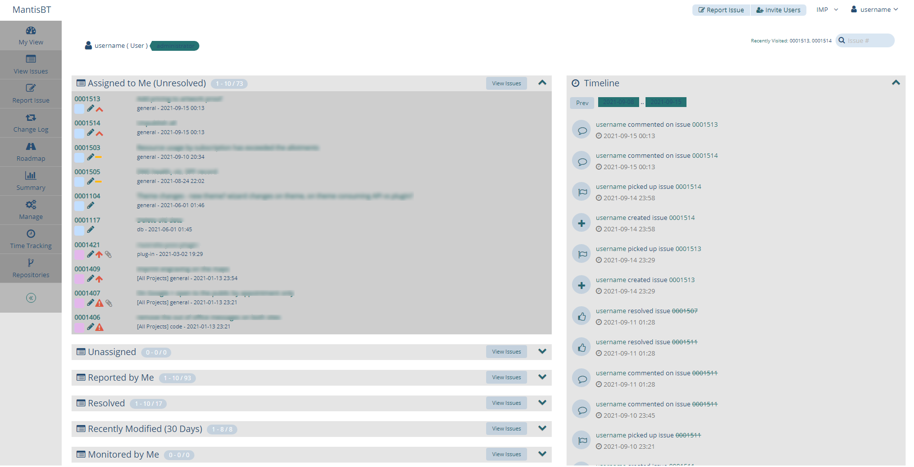
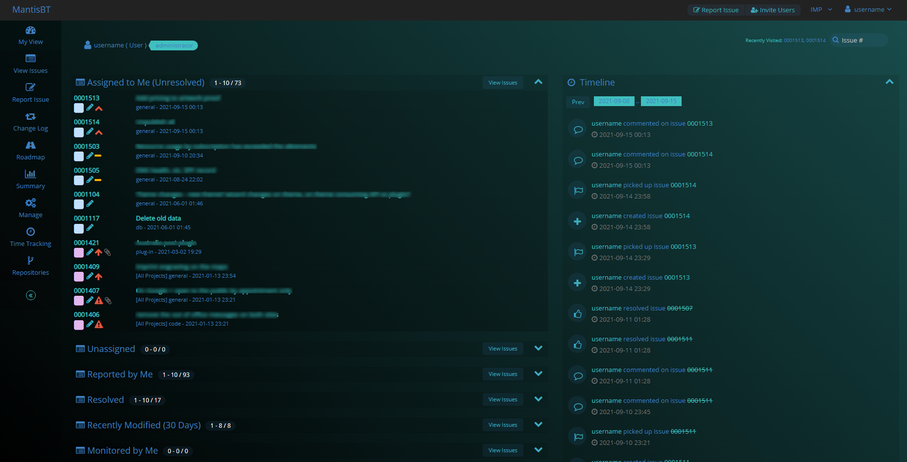

# MantisBT Auto Switch Theme

MantisBT theme which switches between light and dark modes in the day and at night, respectively.

# Mantis Bugtracker Modern Dark Theme

## Installation

Upload the whole folder into your `plugins/` folder in the mantis installation so that you e.g. have `MANTIS_INSTALLATION/plugins/mantisbtAutoSwitchTheme/mantisbtAutoSwitchTheme.php`. After that the plugin should show up on the `manage_plugin_page.php` page in the mantis settings. There you can simply install it to activate it.

Then each user can activate it from their Account > Preferences.

# Credits

forked from : https://github.com/wiz78/MantisBTModernDarkTheme
